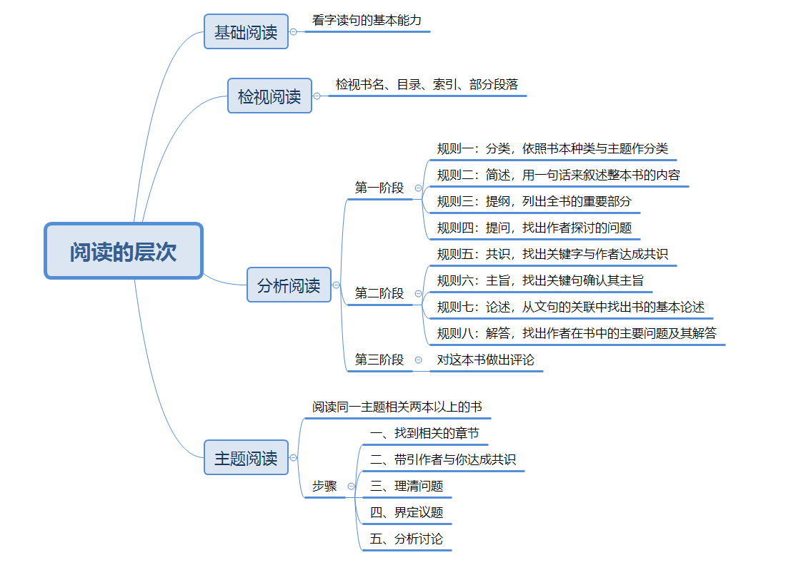

# 《如何阅读一本书》

​	莫提默 · J · 艾德勒

## 阅读的主动性及目的

​	如何阅读好一本书？强调阅读的主动性，在阅读中的每一种活动都参与了更多的技巧。一个人越能运用这些活动技巧，阅读的效果就越好。阅读的目标：为了获得资讯而读，以及为求得理解而读。

​	主动阅读的基础（一个阅读者要提出的四个基本问题）：

1. 整体来说，这本书到底在谈些什么？找出这本书的主题，作者如何依次发展这个主题？
2. 作者细部说了什么？怎么说的？找出主要想法、声明与论点。
3. 这本书说的有道理吗？是全部有道理，还是部分？
4. 这本书和你有什么关系？对你来说书中的资讯有何意义？

## 阅读的层次

