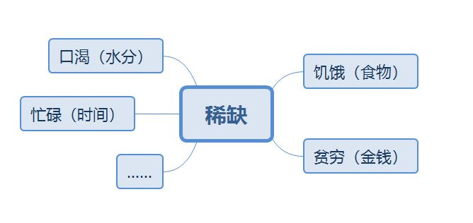

# 稀缺

​	可怕的不是资源稀缺，而是稀缺思维。当你陷入稀缺思维，你的情况会越来越糟糕。

## 一、稀缺心态是一切稀缺的根源

​	`专注红利`、`管窥`、`带宽` 

​	稀缺：就是“拥有”少于“需要”的感觉。

​	稀缺俘获大脑：我们的思想会自动而强有力地转向未得到满足的需要。

​	有时，资源稀缺会带来专注与有限的回报。eg：截止日期、礼券有效期。工作截止日期会让人们在不自觉中提高了工作效率；而有效期礼券相比永久礼券更加提高了企业的收益。

​	专注红利：稀缺会自动将干扰和诱惑等因素推至一旁，让我们做到凭一己之力很难做成的事情。

​	<u>专注是积极的：稀缺会迫使我们专注在迫近的重要事情上；而管窥是消极的：稀缺导致我们有了管窥之见，让我们忽略了其他可能更重要的事情。</u>

​	管窥：专注于某一件事物就意味着我们会忽略其他事物，也叫“隧道视野”。

​	带宽：类似于电脑的内存、cpu内核资源是有限的，及时再强大的电脑在同一时间处理的事情也是有限的。人脑也类似于这种情况，人们处理事情的能力是有带宽上限的。智力、注意力、体力等属于带宽。

​	稀缺所带来的管窥效应，会在无形中占用我们的带宽，使我们无意识地“专注”，因此我们处理事情的能力也响应地被削弱了。

​	结论：稀缺，不仅会令我们入不敷出，不知如何分配资源，而且还会让我们在生活的其他地方手足无措。稀缺会使人变笨，变得更加冲动。我们不得不在流体智力和执行能力被削弱的情况下，依靠更为有限的脑力去勉强度日。生活就是这样变得举步维艰。

>   流体智力（Fluid Intelligence）是一种以生理为基础的认知能力，如知觉、记忆、运算速度、推理能力等。流体智力是与晶体智力相对应的概念，流体智力随年龄的老化而减退。而晶体智力则并不随年龄的老化而减退，晶体智力主要指学会的技能、语言文字能力、判断力、联想力等。——百度百科

## 二、 贫穷和忙碌是如何让“带宽”变窄的

​	`余闲`、`边际效用递减`、`借用`、`现时偏见`、`无力规划`、`社交稀缺`

​	稀缺的本质就是没有余闲。

​	闲余能让我们轻松地避免负担。

​	稀缺会改变我们花的每一分钱、度过的每一个小时、吃掉每一份食物的方式。稀缺会给我们一个不同的结果，装出一个内容不一样的行李箱：大的行李箱总是装的随心所欲，还剩下不少空间；而小的行李箱却总是装得十分谨慎，满满当当。

>   穷蜜蜂和富泥蜂
>
>   ​	小时候常在教科书里看到的“勤劳的蜜蜂”，只是因为它们需要采8千克花蜜才能产生1千克的蜂蜡作为它们的建筑材料，而泥蜂的的建筑材料——土，随处可见。蜂蜜的巢穴十分精密（误差仅在0.002毫米之内），而泥蜂的巢穴是不规则的。——泥蜂在建筑材料上不存在稀缺！

​	经济学家将这种现象（行李箱、蜜蜂泥蜂）称为边际效用递减，即你拥有的越多，对你而言，每一样额外增加的物品的价值就会越低。

>   一个人富有的程度，与他所能舍弃之物的数量成正比。——亨利·大卫·梭罗

​	借用：当人们面临资源稀缺时，就会通过借用相应的时间或金钱来应对突发事件。从长远来看，借用会进一步加剧稀缺。借用与稀缺同在。

​	为何借用？因为明天的稀缺注定无法像今天的稀缺一样俘获你的注意力。

​	现时偏见：人们会见未来的利益作为代价，过高地估计即刻的利益。

​	无力规划：当我们未来解决眼下的难题而季度专注时，就无法有效地规划未来。俘获我们的稀缺，就存在于当下，它所产生的管窥负担，令我们带着短视的眼光做人做事。

​	

​	处在稀缺的人们，他们的犯错成本很高，因为他们深陷在稀缺当中，只要难以再借用资源，他们就难以维持下去。陷入在稀缺的死循环当中。

>   改变心态，才是人们逃离稀缺陷阱的唯一希望。

​	穷人为什么穷？是因为稀缺心态。

​	无能导致贫穷，贫穷也导致无能。

​	穷人缺钱又却带宽。

## 三、如何从稀缺走向富足

1.  逃离管窥，多为自己未来的生活着想
2.  节省带宽，控制不必要的欲望、及时排解不必要的忧虑和烦恼
3.  构建带宽，多学习提高工作效率，多运动保持身体健康
4.  保持余闲，不能太多也不能太少（当然金钱越多越好）
5.  用余闲对抗救火陷阱，拒绝陷入稀缺的耍猴陷阱

