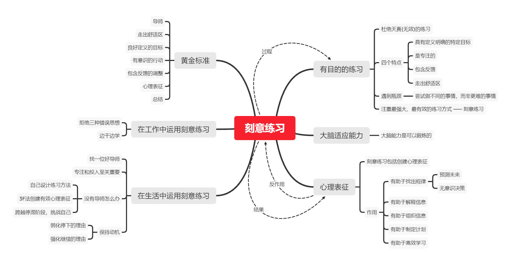

《刻意练习》

`👩‍🏫导师`、`🏃‍♀️走出舒适区`、`📅良好定义的目标`、`🤳有意识的行动`、`📑包含反馈的调整`、`💕心理表征`、`🧾总结`

## 有目的的练习

某种程度上，各种各样的练习都可能有效，但其中一种特殊的形式则是黄金标准，作者在20世纪90年代初期称之为“刻意练习”。这是我们知道的最有效和最强大的练习形式，而且，对刻意练习原则的运用，是为任何行业或领域策划和设计训练方法的最佳方式。

### 有目的的练习 VS 天真的练习

所谓“天真的练习”，基本上只是反复地做某件事情，并指望只靠那种反复，就能提高表现和水平。例如，对着墙面打乒乓球，这既浪费了时间精力，你也不可能从中获得有效的技术提高。

#### 有目的的练习的四个特点

①具有定义明确的特定目标。例如：我们假想的音乐学生如果确定了类似下面这样的练习目标，可能会比他漫无目的的练习要成功得多：“连续三次，不犯任何错误，以适当的速度弹奏完曲子。”

> 有目的的练习，主要是“积小胜为大胜”“积跬步以至千里”，最终达到长期目标。
>
> 关键是接受那个一般目标（并且日渐精进），并将其转化成一些具体目标，使你能达到切合实际的进步的期望。
>
> 练好流行伴奏，先把左手和弦弹好，了解和弦的组成音、指法、节奏、力度

②是专注的。想要取得进步，必须完全把注意力集中在你的任务上。

③包含反馈。

> 一般而言，不论你在努力做什么事情，都需要反馈来准确辨别你在哪些方面还有不足，以及怎么会存在这些不足。如果没有反馈（要么是你自己给自己提出的，要么是局外人给你提出的），你不可能搞清楚你在哪些方面还需提高，或者你现在离实现你的目标有多远。
>
> 练习钢琴时，讲自己弹奏的曲子完整录制下来。仔细听弹得不好的地方，仔细记录下来。

④走出舒适区

> 对于任何类型的练习，这是一条基本的真理：如果你从来不迫使自己走出舒适区，便永远无法进步。
>
> 比如，业余钢琴爱好者在十几岁的时候就开始上钢琴课，等到30年过去了，他还在以完全相同的方式弹奏着那些同样的歌曲，看起来，在那段时间里，他已经积累了数十万个小时的“练习”，但他绝不会比30年前弹得更好。事实上，可能还比年轻时弹得更差。

#### 遇到瓶颈怎么办

通常情况下，这种解决方案并不是“试着做更难的事情”，而是“试着做不同的事情”。

> 这就是史蒂夫在我们的整个记忆研究中一种常规的模式：首先取得进步，然后到了一个瓶颈，被困住了，寻找不同的方法来克服障碍，最后找到了这种方法，然后又稳定地提高，直到下一个障碍出现。

不管什么障碍，越过它的最好办法是从不同方向去想办法，这也是这种方法需要导师或教练的一个原因。有些人已经熟悉了你可能遇到的障碍，于是，可以为你提供克服障碍的方法。

有目的的练习总结：走出你的舒适区，但要以专注的方式制订明确的目标，为达到那些目标制订一个计划，并且想出监测你的进步的方法。哦，还要想办法保持你的动机。对想要提高自己的每个人来讲，这些是让你有一个卓越开端的秘诀——但依然只是开始。

这里有一条重要的经验：尽管我们通过专注的训练和走出舒适区，一般能在某种程度上提高自己做某件事的能力，但那并不是全部。刻苦努力还不够。逼迫自己超越极限，也不够。人们通常忽略了训练与练习中的其他一些同等重要的方面。学术界对一种特定的练习与训练方法进行了研究，该方法已被证明是提高人们在各个行业或领域中的能力的最强大和最有效的方式。这种方法就是**“刻意练习”**。

## 大脑的适应能力

### 大脑就像肌肉，越练越大

在伦敦，要想当一名获得许可的出租车司机，必须通过一系列测试，这些测试一直被人们认为是世界上最难的测试。参加测试的出租车司机需要积累了伦敦市内320条最佳线路，而且探索并记下了查令十字街周边9.6千米内的中心地带的每一处位置。在接受过出租车司机培训的那两组实验对象中，继续参加培训并成为获许可的出租车司机的那些人，海马体后部的体积明显大一些。相反，中途不再参加培训或者没能通过出租车司机系列测试的人们，或是那些和出租车培训项目毫无关系的控制组成员，其海马体后部的尺寸没有变化。

以上案例说明，大脑是具有和人体肌肉类似的适应能力，其能力是可以通过锻炼提高的。

### 走出舒适区的重要性

刻意练习需要让自己走出舒适区，但不能给强加自己太重的负担。

> 一个人遇到的挑战越大，在一定程度上，大脑中的变化也越大。一方面，最近的研究表明，人在学习一项新的技能时，如果能够触发大脑结构的变化，那么，这种学习比起只是继续练习已学会的某项技能时的学习要高效得多。另一方面，在过长的时间内过分地逼迫自己，可能导致倦怠和学习低效。大脑和身体一样，对于处在舒适区之外却离得并不太远的“甜蜜点”上的挑战，改变最为迅速。

## 心理表征

`知识结构`、`信息分析`

### 是什么？

心理表征是一种与我们大脑正在思考的某个物体、某个观点、某些信息或者其他任何事物相对应的心理结构，或具体或抽象。一个简单的例子是视觉形象。例如，一提到蒙娜丽莎，很多人马上便会在脑海中“看到”那幅著名油画的形象；那个形象就是蒙娜丽莎在他们脑海中的心理表征。

有些人的表征比其他人更详尽、更准确，而且，他们还能描述关于背景的细节，比如说，描述画中的蒙娜丽莎在哪里坐着，以及她的发型和眉毛的模样。

#### 刻意练习包括创建心理表征

大多数的刻意练习包括创建更加有效的心理表征，不论你在练习什么，都可以使用这些心理表征。例如：当接受过伦敦出租车司机训练的人们在学习高效地从甲地到乙地的导航时，包括在城市中所有行驶路线上导航时，他们通过描绘这座城市越来越复杂的心理地图来导航，也就是说，通过创建心理表征来导航。

#### 行业或领域的特定性

由于各个行业或领域之间心理表征的细节具有极大差异，我们难以给出一个十分清晰的顶层定义，但基本上，这些表征是信息预先存在的模式（比如事实、图片、规则、关系，等等），这些模式保存在长时记忆之中，可以用于有效且快速地顺应某些类型的局面。对于所有的心理表征，有一点是相同的：**尽管短时记忆存在局限，但它们使得人们可以迅速地处理大量信息。**事实上，人们可能把心理表征定义为一个概念式的结构，设计用于回避短时记忆施加在心理加工上的一般局限。

#### 心理表征铸就杰出表现

将杰出人物与其他人区别开来的因素，正是前者心理表征的质量与数量。通过多年的练习，他们针对本行业或领域中自己可能遇到的各种不同局面，创建了高度复杂和精密的表征，比如，在比赛期间可能出现的国际象棋棋子的各种配置。这些表征使他们能够做出更快更准确的决策，并且在特定的局面上更快更有效地应对。这是其他任何方法都无法比拟的，它解释了新手与专家之间的差别。

### 心理表征的作用

①有助于找出规律

> 几乎在每一个行业或领域，杰出表现的标志是能在一系列事物中找出规律，这些事物，在无法创建高效心理表征的人们看来，可能是随机或令人困惑的。换句话讲，杰出人物能够看到“一片森林”，而其他所有人，却只看见“一棵树”。

②有助于解释信息

> 心理表征的一个重要好处在于，可以帮助我们处理信息：理解和解读它，把它保存在记忆之中，组织它、分析它，并用它来决策。对所有的杰出人物来讲，都是这个道理，而且，无论我们自己是不是知道，我们大多数人都是某件事情的专家。
>
> 你对某个主题研究得越多，对该主题的心理表征也变得越细致，也越能更好地消化新的信息。因此，国际象棋高手可以看懂棋谱，那些对大多数人来说，是完全没有意义的数据，比如1.e4e52.Nf3Nc63.Bb5a6……

③有助于组织信息

> 成功诊断的关键并不只是拥有必要的医学知识，而是能够将这种知识组织起来，以便提出可能的诊断结果，并聚焦于最有可能的诊断结果。
>
> 由于最优秀的保险代理人都更好地组织了他们对保险产品的了解，因此，在任何特定的场合下，他们能更为迅速和准确地想出该怎么推销保险产品，这也使得他们成为更加高效的代理人。

④有助于制定计划

> 心理表征可以用来为很多行业和领域做计划，表征越好，计划就高效。

⑤有助于高效学习

> 一般来讲，心理表征并不只是学习某项技能的结果，它们还可以帮助我们学习。
>
> 在任何一个行业或领域，不只是音乐表演领域，技能与与心理表征之间的关系是一个良性循环：你的技能越娴熟，创建的心理表征就越好；而心理表征越好，就越能有效地练习，以磨炼技能。

## 黄金标准

练习时间是最重要的差别。

如果不花费无数小时的时间进行刻苦练习，没有人能够培养杰出的能力。

刻意练习也是一种有目的的练习，而且知道该朝上面方向发展，以及怎么样去达到目的。

### 刻意练习的特点

简而言之，刻意练习具有以下特点：

`👩‍🏫导师`、`🏃‍♀️走出舒适区`、`📅良好定义的目标`、`🤳有意识的行动`、`📑包含反馈的调整`、`💕心理表征`、`🧾总结`

◆刻意练习发展的技能，是其他人已经想出怎样提高的技能，也是已经拥有一整套行之有效的训练方法的技能。训练的方案应当由`导师`或教练来设计和监管，他们既熟悉杰出人物的能力，也熟悉怎么样才能最好地提高那种能力。

◆刻意练习发生在人们的`舒适区之外`，而且要求学生持续不断地尝试那些刚好超出他当前能力范围的事物。因此，它需要人们付出近乎最大限度的努力。一般来讲，这并不令人心情愉快。

◆刻意练习包含得到`良好定义的特定目标`，通常还包括目标表现的某些方面；它并非指向某些模糊的总体改进。一旦设定了总体目标，导师或教练将制订一个计划，以便实现一系列微小的改变，最后将这些改变累积起来，构成之前期望的更大的变化。改进目标表现的某些方面，使得从业者能够看到他的表现已经通过练习得到了提高。

◆刻意练习是有意而为的，也就是说，它需要人们`完全的关注和有意识的行动`。简单地遵照导师或教练的指示去做，还不够。学生必须紧跟他的练习的特定目标，以便能做出适当的调整，控制练习。

◆刻意练习`包含反馈`，以及为应对那些反馈而进行`调整`的努力。在练习过程的早期，大量的反馈来自导师或教练，他们将监测学生的进步、指出存在的问题，并且提供解决这些问题的方法。随着时间的推移，学生必须学会自己监测自己、自己发现错误，并做出相应调整。这种自我监测，需要高效的心理表征。

◆刻意练习既产生有效的`心理表征`，又依靠有效的心理表征。提高水平与改进心理表征是相辅相成的，两者不可偏废；随着人们水平的提升，表征也变得更加详尽和有效，反过来使得人们可能实现更大程度的改进。心理表征使人们能监测在练习中和实际的工作中做得怎么样。它们表明了做某件事的正确方法，并使得人们注意到什么时候做得不对，以及怎样来纠正。

◆刻意练习通过着重关注过去获取的技能的某些特定方面，致力于有针对性地提高那些方面，并且几乎总是包括构建或修改那些过去已经获取的技能；随着时间的推移，这种逐步的改进最终将造就卓越的表现。由于新技能的学习是建立在现有技能基础上的，因此，导师会为初学者提供正确的基本技能，使学生后来能在更高层面上重新学习那些基本的技能。

## 在工作中运用刻意练习原则

### 拒绝三种错误思想

第一种，认为某人的能力通常收到基因特征的限制。

第二种，如果你足够长时间地做某件事情，一定会更擅长。

第三种，要想提高，只需要努力。

### 边干边学

“边干边学”方法的一个好处是，它使人们熟悉练习的习惯，并思考如何练习。一旦他们理解了日常练习的重要性，并意识到可以用练习来实现多大的进步，那么，他们会找机会将其他的日常商业活动转变成练习活动。到最后，练习变成了日常工作的一部分。

## 在生活中运用刻意练习原则

### 首先，找位好导师

有的人知道学习某些事情的最佳次序，理解并示范正确的方式来展示各种各样的技能，可以提供有效反馈，并且能够设计一些专门用来克服特定缺陷的练习活动，在这些人的指导之下，激情十足和孜孜不倦的学生能够更加迅速地取得进步。因此，为了你的成功，最重要的一件事情是找一位好导师，并向他请教。

当然，专注和投入也至关重要。

### 没有导师怎么办

也许你请不起导师，或者一下子找不到什么人来教你想要学习的东西。也许在你有兴趣提高自己水平的那些领域或行业之中，你没有发现杰出人物，或者至少没有导师。不论是什么原因，如果你遵循刻意练习的一些基本原则依然可能实现进步。

#### 自己设计练习方法

有目的的练习，或者说刻意练习，其标志是你努力去做一些你无法做到的事情，去完成一些处在你的舒适区以外的任务，而且，你一而再再而三地练习，着重关注到底可以怎么做好它，在哪方面还有缺陷，以及你可以怎样进步。

为了提高，我们必须自己创造机会。

毫无目的地一遍一遍地做同一件事情，并不是好办法；反复做一件事情，目的是找出你在哪些方面存在不足，并且聚焦于在那些方面取得进步，试着采用不同的方法来提高，直到你最终找到适合自己的方法。

#### 用“三个F”创建有效的心理表征

为了在没有导师的时候有效地练习某种技能，牢牢记住以下三个F，将是有帮助的。这三个F，其实是以字母F开头三个单词，即：专注（focus）、反馈（feedback）以及纠正（fixit）。

#### 跨越停滞阶段

##### 以新的方式挑战自己。

当你首先开始学习某些新东西时，发现自己进步神速，或者至少是稳步前进，这十分正常，当那样的进步停滞下来时，你自然会以为自己遇到了某种无情的限制。因此，你停步不前，最后就让自己停滞在那一水平。这是几乎任何一个领域或行业中的人们不再进步的主要原因。

要越过这种停滞阶段，最好的办法是以新的方式挑战你的大脑或身体。例如，健美运动员会改变他们训练的类型，增加或减少他们举重的力量或反复练习的次数，并且每周变换一下训练日程。实际上，他们大多数人会主动地变换训练模式，使自己不至于一开始就陷入停滞。各种类型的交叉训练，也是基于这一相同的原则——在不同类型的训练之间切换，以便可以持续不断地以不同方式挑战自己。

### 保持动机

保持动机也许是每个投入到有目的训练或者刻意练习中的人最终要面对的最大问题。

保持这种推行此类体制运行下去的动机，包括两个组成部分：继续前行的理由和停下脚步的理由。

#### 弱化停下脚步的理由

其中最有效的一种是留出固定的时间来练习，不受所有其他义务和分心的事情所干扰。

逼迫自己走出舒适区很痛苦，有两件重要的事情需要确保：1、身体保养，保证休息时间来维持经理；2、练习课的时间限制在1小时左右。

幸运的是，你将发现，随着时间的推移，继续练习似乎更容易一些。你的身体和大脑将习惯练习和锻炼带来的痛苦。

#### 强化继续前进的倾向

动机一定是一种强烈的渴望，渴望做你更擅长的事情，不论那些事情是什么。

重要的动机因素是相信自己可以成功。当你真的觉得不喜欢自己的状态，为了逼一下自己，你必须相信你可以提高自己，并且跻身最优秀者的行列，特别是对那些着眼于成为本行业本领域杰出人物的人而言。这种信念的力量十分强大，甚至可以战胜现实。

> 1、将对同一件事情感兴趣的所有人聚集起来，或者吸引他们加入一个现有的团体，并且将团体的同志情谊和共同的目标作为达到你自己目标的额外动机。
>
> 2、将漫长的旅程分解成一系列可控的目标，并且每次只关注它们中的一个，甚至可以在每次达到一个目标时，给自己小小的奖励。

