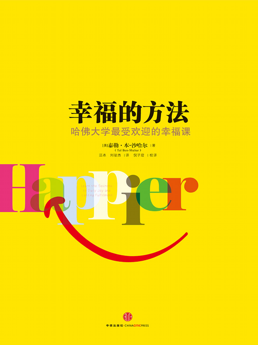
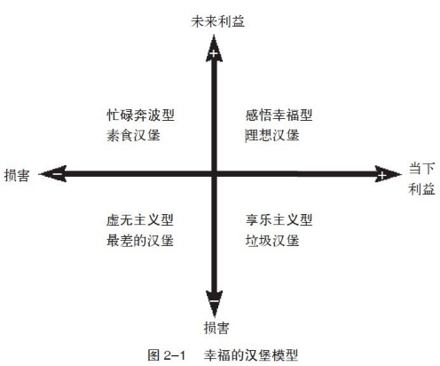

# 《幸福的方法》

作者：泰勒·本-沙哈尔

Happier Learn the Secrets to Daily Joy and Lasting Fulfillment

`🍔汉堡模型`、`💴终极财富`、`💪积极心理学`、`🤔反思`、目标感、潜力、快乐与意义、当下和未来

> 摘录：
>
> 本书分为三篇。第一篇有5章，介绍了什么是幸福以及幸福生活的重要组成因素。在第二篇的第6章到第8章中，讨论了如何把这些观点应用到教育、工作以及家庭生活中。最后一篇则包括了7个关于幸福的思考，我提出了一些有关幸福本质的思考，以及它们是如何影响我们的生活的。

## 什么是幸福？

幸福很难去定义。

真正的幸福不应该是绝对不掺杂不良的情绪，而是经得起困难和挫折的考验。

幸福不是稍纵即逝的快乐、不是从天而降的好运、不是纵欲后的满足、不是……

> 反思：
>
> 幸福是“想要”和“得到”之间的为之努力过程。

### 疑惑

#### 从幸福到更幸福

当幸福成为一个终点，一旦到达，我们对幸福的追求就结束了。实际上这个终点并不存在，对这一误解的执着只能导致不满和挫败感。

我们永远都可以更幸福。没有人能够永远都非常满足而无欲无求。

幸福是一个需要长期追求、永不间断的过程，而不是一个可以终结的句点。

“让自己更幸福”应该是我们终身追求的目标。

#### 养成习惯：我们的习惯造就了我们

《The Power of Full Engagement》(《精力管理》) —— “养成习惯要求确定行动的细节，并规定在特定的具体时间内完成，这需要感受到深刻价值作为行事动机”。

寻找能让你更幸福的新习惯。

#### 表达感恩：每天记下5见值得感恩的事

罗伯特·埃蒙斯（RobertEmmons）和迈克尔·麦卡洛（MichaelMcCullough）的研究表明，每日把那些值得感恩的事情记录下来的人（每天写下最少5件值得感恩的事），确实在身体上更健康、内心更幸福。

### 解读人生的四种汉堡模型

四种汉堡模型，四种人生模式

①风味诱人的垃圾食品——享乐主义型：寻找快乐并且逃避痛苦，只是盲目地满足欲望而不考虑后果。

②口味很差却很健康的——忙碌奔波型：错误地认为成功即幸福，坚信目标实现后的放松和解脱即是幸福。

③及不健康又不好吃的——虚无主义型：放弃追求幸福，不再相信生活是有意义的。

④健康又美味理想汉堡——感悟幸福型：享受当下的快乐以及未来的幸福。快乐与意义、当下和未来的结合。

“忙碌奔波型”是未来的奴隶，“享乐主义型”是现在的奴隶，而“虚无主义型”则是过去的奴隶。

真正能够持续的幸福感，需要我们为了一个有意义的目标快乐地努力与奋斗。幸福不是拼命爬到山顶，也不是在山下漫无目的地游逛，幸福是向山顶山顶努力攀登过程中的种种经历和感受。

> “人类最好的时刻，通常是在追求某一目标的过程中，把自身实力发挥得淋漓尽致之时”
>
> ——米哈李·齐克森米哈伊

### 幸福是什么?

幸福的定义应该是“**快乐与意义的结合**”。真正快乐的人，能够在自己觉得有意义的生活方式里享受它的点点滴滴。这种解释绝不仅限于生命里的某些时刻，而是人生的全过程。即使有时经历痛苦，人在总体上仍然可以是幸福的。

#### 幸福的意义

幸福和成功之间存在强烈的相互作用：成功（无论是工作还是感情方面）可以带来幸福，而幸福本身也可以带来更多成功。

在其他条件一样时，幸福的人拥有更好的人际关系，在工作上的表现更好，活得也更开心、更长寿。幸福是值得去追求的，无论是作为目标还是达到目标的方法。

#### 快乐

幸福并不需要一直高涨的情绪，也并不是完全没有负面情绪。

一个幸福的人也会有情绪上的起伏，但他会在整体上保持一种积极的人生态度。他经常被积极的情绪推动着，比如欢乐和爱，而很少被愤怒或内疚这些负面情绪所控制。快乐是常态，而痛苦只是小插曲。想要获得真正的幸福，就必须明白无论遇到怎样的悲伤、考验或是波折，我们都应该为活着本身而感到由衷的快乐并感恩。

> 积极的情绪体验是幸福的必要但非充分条件。

#### 意义

当想到有意义的生活时，我们经常谈到目标，却忽略了**目标感**其实比设定目标更重要。当然，有目标或者实现目标并不能保证我们必然感受到生存的意义。我们真正需要的是那些让我们从内心感到有意义的目标。

当想到对自己最有意义的生活时，我们需要同时考虑如何充分地发挥自身的**潜力**。

> “真正令人满意的幸福总是伴随着充分发挥自身的才能来改变世界”。
>
> ——哲学家伯特兰·罗素

经历困难可以让我们更加珍惜快乐，不再认为快乐是理所当然的，同时对生命中大大小小的欢乐心存感激。对生活心存感激本身也是生命意义和快乐的重要来源。

**意义和快乐，就像短期利益和长期利益一样可以相互促进。**

#### 真正的幸福

增强幸福感最好的方法就是尝试、汲取经验，同时关注内在的感受。大多数人都忘了问问自己的内心，只因为我们太忙了。就像梭罗所说，“生命并不长，别再赶时间了”。如果老是马不停蹄地前进，那就等于只是简单地对每日的生活做出反应，却没有给自己足够的空间去创造真正的幸福。

现在我们花些时间，问自己一些可以帮助我们做出人生选择的问题：我做的事情对我有意义吗？它们能给我带来乐趣吗？我的内心是否鼓励我进行不同的尝试呢？我的内心是不是提醒我需要彻底改变目前的生活？我们必须留心去听，倾听我们的内心和头脑中不同的声音，即情感和理智。

### 幸福才是人生的终极财富

在商业中，我们用资产的现金价值来衡量公司；对个人而言，幸福感应该是我们衡量人生成就的唯一标准，因为它是所有目标中的最终目标。

#### 幸福大萧条

就像公司会破产一样，心灵也有可能破产。

在看待自己的生命时，你可以把负面情绪当作支出，把正面情绪当作收入，当正面情绪多于负面情绪时，我们在幸福这一“终极财富”上就赢利了。长期的抑郁也可以被看成是一种情感破产——负面情绪持续的时间和强度完全压倒了正面情绪。

幸福就像财富，需要你不断的积累。

### 设定幸福目标

做一个幸福的人，必须要又一个明确的可以带来快乐和意义的目标，然后努力去追求。同时，目标的实现就是一次幸福的终点。如要幸福，则需要给自己源源不断的目标感。

#### 目标与成功

目标向我们及他人传达了以终客服困难的信念。

“把背包扔到墙的另一边”——一个人在下决心之前容易犯犹豫不决的毛病，容易退缩，效率降低。但重要的是，当你真正决定兑现承诺的时候，命运也会开始帮助你。

一个目标，一个明确而的承诺，可以让我们集中注意力，帮助我们找到达到目标的路线。心理学家告诉我们，信念是以终会自动实现的语言。而当我们下定决心，把背包扔过墙头时，我们事实上已经相信了自己，相信了自身的能力。我们一颗去创造现实，而不只是对现实做出被动的回应。

#### 目标的意义

目标的作用是为了帮助我们解放自我，这样我们才能享受眼前的一切。

> “当代研究指出，为实现目标的奋斗过程，比达到目标更能带来幸福和积极的情绪影响。”
>
> ——戴维·沃森

目标是未来让我们能享受眼前，目标是意义，不是结局。

 如果想保持幸福感，就必须改变我们通常对目标的期望：与其把它当成一种结局（相信它可以使我们开心），不如把它看作是意义（相信它可以加强我们旅途中的快乐感受）。当目标被认可为意义时，它才会帮助我们规划旅途中的每一步；而目标被认为是结局时，它所带给我们的只会是无尽的困难和挑战。正确的目标认知，带给我们的是一种安宁。

目标是获得幸福的必需品，但它并不是全部。我们一定要明白，除了目标本身必须是有意义的之外，它在旅途中带给我们的快乐也是不可缺少的。

> “对于追求幸福的人来说，建议去追求包括成长、人际关系和对社会又贡献的目标，而不是金钱、美貌和声望。对后者的追求，通常是出于必须和压力的心态。”

#### 自我和谐的目标

自我和谐的目标，是发自内心最坚定的意识，或是最感兴趣的事情。

这些目标是有因果关系的：追求这些目标，并不是因为他人觉得你应该这么做，也不是出于责任感，而是因为它对我们具有更深层的意义并且能够带给我们快乐。

研究也指出，那些外在目标的意义，比如我们在社会上的声望或是银行存款，它与我们内在目标的意义，比如个人成长或是与他人的关系，有着显著的不同。财富上的目标通常不是出于自我和谐，而是出于外在因素。大部分追求财富的人，为的是满足自身对金钱和社会地位的虚荣心。

在另一种情况下，财富也可以是发自内心的目标，即它成为达成意义的手段。比如说有足够的金钱时，我们可以做很多对自己有意义但没时间去做的事，或者可以用它去支持我们认为有意义的事情。

总之，设定幸福目标，我们首先必须知道我们的生命需要什么，然后诚实地面对自己的愿望并且对它负责。

## 如何才能幸福？

### 幸福学习法

两种学习动机模式——“溺水模式”与“性爱模式”。

“溺水模式”有两个特点：（1）有从痛苦中解脱的强烈愿望；（2）一旦解脱，我们常会把那种舒适误认为是幸福。如果把一个人的头按进水里，这个人会痛苦，会挣扎着要出来。如果他在最后一刻离开水，他第一件事就是拼命地呼吸，接着便是那醉人的解脱感。

但“性爱模式”却提供了一种不同的学习方式，一种可以同时得到当下与未来幸福的模式。那些美好的学习时光，无论是阅读、研究、思考还是写作，都可以将其视为性爱的前奏。学生们的经验表明，当知识和直觉的界限消失时，即当我们找到答案时，就像是性高潮的感觉。在“溺水模式”里同样会有这种达成目标后的高潮，但在“性爱模式”中，我们却是从一开始乃至每一件事里都能得到快乐。（其实就是《情商》里面的心流）让学习成为一种快乐的事情。

#### 幸福面前人人平等？

正如18世纪经济学家和哲学家亚当·斯密所说，“关于人类的幸福感，穷人相比富人，幸福感并没有任何优劣之分”。虽然亚当·斯密是站在一个特权阶层的角度说话（他与当时的主流社会格格不入），但至少他说对了一点，那就是穷人的痛苦和欢乐，无论是在质量或数量上，和富人并无差别。在基本的生存条件（食物、住所、适当的教育）达到后，从情感的角度来说，经济状况并不会造成显著的差异。

#### 工作让你更幸福？

当我们对幸福的看法很刻板（即当我们把努力和挣扎排除在幸福感的来源之外）时，其实忽略了一些获得幸福的最大可能性。在学校和工作中，我们忽略了获得幸福的机会；在学校和工作之外，我们又拼命地消灭所有的挑战和困难。结果导致我们产生了这样一种感觉：幸福真是遥不可及。

### 幸福工作法

#### 热情是幸福的动力

我们投入到工作中的努力，是无法仅用收入来衡量的。就像机器人的例子所说明的，如果没有任何热情，我们很快就会丧失兴趣。情感激发行动，热情则是我们的动力。

> 金钱和幸福都是生存的必需品，并非相互排斥。

## 幸福的本质，它是如何影响我们的生活的？

