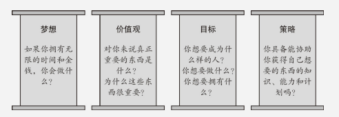
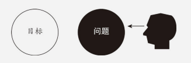
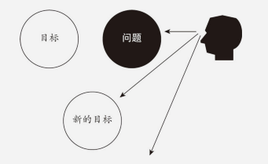
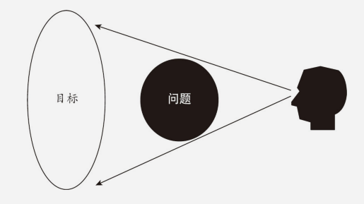
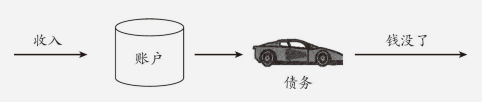
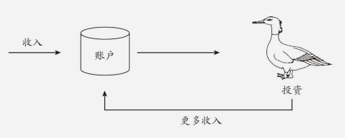
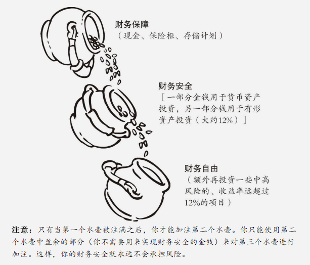
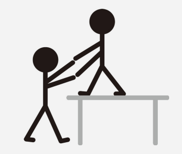

# 《财务自由之路》

​	作者：博多·舍费尔。`成功日记` `梦想相册` `养鹅🦆` `财务💰自由`

## 目录

* [《财务自由之路》](#%E8%B4%A2%E5%8A%A1%E8%87%AA%E7%94%B1%E4%B9%8B%E8%B7%AF)
  * [目录](#%E7%9B%AE%E5%BD%95)
  * [基本原则](#%E5%9F%BA%E6%9C%AC%E5%8E%9F%E5%88%99)
  * [实用指南：第一个100万欧元](#%E5%AE%9E%E7%94%A8%E6%8C%87%E5%8D%97%E7%AC%AC%E4%B8%80%E4%B8%AA100%E4%B8%87%E6%AC%A7%E5%85%83)
    * [债务](#%E5%80%BA%E5%8A%A1)
      * [遵循50/50原则](#%E9%81%B5%E5%BE%AA5050%E5%8E%9F%E5%88%99)
    * [如何增加自己的收入](#%E5%A6%82%E4%BD%95%E5%A2%9E%E5%8A%A0%E8%87%AA%E5%B7%B1%E7%9A%84%E6%94%B6%E5%85%A5)
    * [储蓄——支付自己](#%E5%82%A8%E8%93%84%E6%94%AF%E4%BB%98%E8%87%AA%E5%B7%B1)
    * [复利的奇迹](#%E5%A4%8D%E5%88%A9%E7%9A%84%E5%A5%87%E8%BF%B9)
    * [你为什么必须饲养金钱](#%E4%BD%A0%E4%B8%BA%E4%BB%80%E4%B9%88%E5%BF%85%E9%A1%BB%E9%A5%B2%E5%85%BB%E9%87%91%E9%92%B1)
    * [投资者和股民应遵从的原则](#%E6%8A%95%E8%B5%84%E8%80%85%E5%92%8C%E8%82%A1%E6%B0%91%E5%BA%94%E9%81%B5%E4%BB%8E%E7%9A%84%E5%8E%9F%E5%88%99)
    * [财务保障、财务安全和财务自由](#%E8%B4%A2%E5%8A%A1%E4%BF%9D%E9%9A%9C%E8%B4%A2%E5%8A%A1%E5%AE%89%E5%85%A8%E5%92%8C%E8%B4%A2%E5%8A%A1%E8%87%AA%E7%94%B1)
      * [财务保障](#%E8%B4%A2%E5%8A%A1%E4%BF%9D%E9%9A%9C)
      * [财务安全](#%E8%B4%A2%E5%8A%A1%E5%AE%89%E5%85%A8)
      * [财务自由](#%E8%B4%A2%E5%8A%A1%E8%87%AA%E7%94%B1)
    * [教练和专家网络](#%E6%95%99%E7%BB%83%E5%92%8C%E4%B8%93%E5%AE%B6%E7%BD%91%E7%BB%9C)

## 基本原则

​	本书的基本原则分为五章：

1. 你真正想要的是什么？
2. 责任意味着什么？（成功日记）
3. 100万欧元是难以企及的奇迹吗？
4. 为什么没有更多的人变得富有？（梦想相册）
5. 你关于金钱的真正想法是什么?

​	金钱的重要性是人们赋予的。作者的父亲是一名拥有正义感的律师，他帮助穷人们解决他们的财务纠纷，穷人在诉讼中往往都是弱势群体，难有能力维权，当财务出现问题，金钱就变得尤为重要。作者年幼就明白贫穷使人生活不幸，所以立志成为一个富人。

- 乐观主义让你看到事物的积极面，而自信给你一种战胜事物黑暗面的信心（总之，想成为富人一定要自信🤑）。自信是指，一个人在自身经历的基础上，知道他遇事可以依靠自己（所以，自信还要建立在实践的基础上）。你的思维方式铸就了你今天的样子，然而这样的方式不能让你成为你想成为的样子（你需要改变💪🏻）。
- 金钱不会解决你所有的问题，它绝对不是万能的。但是，缺点却能使你的幸福蒙上一层阴影。
- 成功意味着成为最好的自己，幸福是热爱你现在的样子。
- 人生的选择：拥有一台赚钱机器，还是穷其一生成为一台赚钱机器。
- 你的一生中能否有所作为，并不直接取决于你铁 一般的行动准则， 而是与你的梦想、目标、价值观和策略直接相关。

​	责任这个单词在英语中叫作叫作“ responsibility”， 在这个单词中隐藏着另外两个单词“ response”（ 回应） 和“ ability”（ 技巧）。 因此，责任这一 词用英语来解释就是：<u>有技巧地进行回应</u>。

​	古巴比伦人的道理：“明智的行为会伴随我们一生，使我们感到快乐，救我们于危难；同样地，愚蠢的行为也会伴随我们，使我们备受折磨，烦恼不堪。”

​	责任意味着：没有任何东西能改变你的态度或品格，因为你是按照自己的本性对事物做出反应。你可以决定自己以那种方式去生活。这种态度使你能够生活幸福，并且成为最好的自己。如果你勇于承担责任，那么你就能在7年内变得富有。

> 能量贴士——成功日记
>
> ​	通过每天写成功日记来建立自己的自信心。
>
> - 我们的自信心决定我们是否敢于去冒险，不去冒险便不可能获得成长。
> - 我们的思想意识、我们收到的教育、我们周围的环境，总体上不利于我们自信心的培育。健全的自我评估意味着自信。成功日子会使你意识到自己有多优秀。
> - 写日子时， 你学会了去注意自己的长处。
> - 在一段时间之后，你就会开始发现自己的长处并想：这件事我可以把它写进我们的成功日记里。
> - 我们的期望决定我们会后的什么。我们的自信有决定我们的期望。

- 深刻的变化发生于5个层次之上：采取行动、运用技巧、个人发展、世界观和自我认知。
- 机遇中能看见风险，风险中能看见机遇。创造奇迹需要承担风险。
- 信心不足的人不敢冒险，他们也以此来保护自己。
- 惊人的好运是连续多年准备所产生的结果。

​	为什么没有更多的人变得富有？穷人往往都有以下特征：

1. <u>穷人对财富没有明确定义。</u>

   清晰定义财富需要三个条件：你必须知道明确的数字（后面章节有提到），写下这个数字，并且将它们转换成画面。（你需要一本梦想相册📔）

2. <u>穷人的财富目标摇摆不定。</u>

   每当自我感觉良好时，我们都倾向于提高自己的目标；当处于低潮期时，我们又都喜欢降低自己的目标。然而，我们的潜意识喜欢稳定而持续的运动。

   你需要一个大目标。因为过于渺小的目标总是会被现实问题遮挡，让你没有动力；然而一个拥有一个大目标，会让所有问题都渺小得不过如此。

   

   

   

3. <u>穷人从不将财富看成绝对必需品。</u>

   经常翻阅你的梦想相册📔。过一段时间你会发现：不实现相册里的这些目标，你将无法幸福。一成不变的生活对你来说是巨大的痛苦。你一定要实现自己的目标。

4. <u>穷人做不到坚持到底。</u>

5. <u>穷人不去承担责任。</u>

   永远不要让别人替你承担责任的情况出现，你要为你自己负责。

6. <u>穷人不准备付出110%的努力。</u>

7. <u>穷人缺少一个好的教练。</u>

8. <u>穷人只关注自己的劣势。</u>

> 能量贴士——梦想相册
>
> ​	明确你想要什么，编制一本与此相关的梦想相册：
>
> - 只做一本图册，将会成为你未来生活一部分的东西的图片贴上去。
> - 思考你想做什么，你想拥有什么，你想成为什么样的人。
> - 请选取哪些能够打动你的图片。
> - 尽可能频发地翻看你的梦想图册
> - 之后闭眼，想象如果一切成真，你能看到、听到、感觉到、闻到、尝到什么。

- 每一个达成过远大目标的人，都是讲90%的精力放在“为什么”上，只讲10%的精力放在“怎么做”上。

## 实用指南：第一个100万欧元

### 债务

​	<u>消费贷根本没有优点</u>。更确切的说：消费贷是愚蠢的行为，对人产生破坏性的效果，打击人的积极性，消磨人的精力，使人最终陷入一种恶性循环。债务一般产生与某个人想要避免眼下痛苦的时候：一个人买不起自己喜欢的东西，就意味着放弃，放弃就以为在痛苦。

​	总有不可预料的情况出现在我们的预期之外。借贷消费，就是用将来的收入来支付。现在，未来的收入还没有到手，意料之外的情况随时可能出现。

#### 遵循50/50原则

​	千万不要将你能存下数额的50%以上用于支付债务。——请马上就开始存续，不必等到一无所有才开始。

> 能量贴士
>
> ​	从你每月余钱中抽出50%用于偿还债务，其余50%存下来。
>
> - 这样一来，你就可以马上积累积累财富了。
> - 你的努力要以能够激发你动力的目标为导向：你再积累财富的同时也清除了你的债务。
> - 通过建立现金存储来培养你的财富意识。
> - 你总是有钱来应对紧急情况。这样对你大有裨益，因为负债累累的情况下，你很难再申请到信用卡来应对突发事件，

- 自由的定义：自律地去执行自己计划好的事情。
- 我们拥有什么样的期望，也就决定了我们能获得什么。
- 战胜债务的最佳方式就是积累财富。
- 压力对你来说，可以使毒药，也可以是良方。
- <u>永远不要用短期解决方案来应对长期问题</u>。
- 债务不要紧，要紧的是是我们处理债务的方式。

### 如何增加自己的收入

- 每个人都会获得他应得的。你值得拥有多少，这完全掌握在你自己手中。

- 你不会因为自己需要更多就得到更多，而是因为你值得更多。你应该关心自己的 义务，而非关心自己的权利。

- 你的付出，应该大于别人对你的期望。让你周围所有人都感到惊喜吧，超出别人对你的所有期望吧。优秀还不够，追求卓越吧。

- 你的收入同你的自信并肩成长。

  ​

### 储蓄——支付自己

​	沃伦·巴菲特是没过最富有的人之一。早在1993年，《福布斯》杂志估算他的财产就已达到170亿美元。他是如何变得如此富有的呢？他的秘诀就是：储蓄、投资；继续储蓄、继续投资。

- 使你变得富有的是储蓄而非收入

- 储蓄意味着支付自己。投入10%的收入饲养你的“鹅”。

- 只有当你的钱多到可以使你仅靠利息便可生活时， 你才算真正富有和独立。

- 如果你没有赚钱机器，那么你就是一台赚钱机器，值造出你值得获得的金钱。

- 一般只有在缺钱的时候，金钱才会成为生活的重要组成部分。

- 引导你的孩子去接收储蓄的概念。

  ​

### 复利的奇迹

- 使自己的资本增值的人，会成为一个富有的人。而无视资本增值法则的人，会再次失去他的金钱。
- 复利的三个重要因素：时间、利润率和投入。
- 你越早开始，你就能越早地实现它。

### 你为什么必须饲养金钱

> ​	法老做了一个使他十分不安的梦。他看见7头漂亮、健康的奶牛从尼罗河中爬起来，身后有7头丑陋的奶牛浮出水面，它们十分干枯瘦弱，身上的骨头都能数得清。突然，干瘦的奶牛猛然扑向肥美的奶牛，并将它们吃掉了。尽管如此，它们看起来仍然那么干枯瘦弱。
>
>  	……
>
> ​	法老询问约瑟夫，约瑟夫答道：“虽然你无法改变它，但你可以做好准备。委任一名财政部长，负责将所有人在富庶年间收获粮食的1/5收集在谷仓里。这样一来就会在饥荒年间有充足的粮食储备。”

- 你必须为自己的未来主动承担责任。成为自己的财务部长，至少将收入的10％存下来，并尽可能地存下收入的20％。
- 想要饲养金钱的人，就必须投资金钱并获得收益。
- 市场波动一直都是周期性的。重要的是将危机纳入我们的考虑范围中。
- 纯粹的投机者会成为危机的受害者，而投资者会成为受益者。不要因为极端情况而动摇自己。也不要去追随大多数人的做法。坚持你自己的计划。
- 坚持固有的原则，做出相应的决定。
- 借口是我们讲给自己听的谎言。借口使我们贫穷。
- 我们每个人身上都有两个声音，财务失败者的声音和财务受益者的声音。我们能否实现财务自由，对此起决定性作用的是，我们听从的是两个声音中的哪一个。

  ​

### 投资者和股民应遵从的原则

​	为了生存，我们必须学习。为了实现财务自由，我们必须学习。更甚至未来保持财务自由，我们还是必须学习。学习是为了学会区分。一旦能够识别差异，你就可以做出明智的决定。

​	关键的区别在于：

1. 投资和投机的区别

   投资是长期行为，投机是短期行为

2. 负债和投资的区别

   

   

3. 三种投资类型的区别

4. 普通投资者和投资家的区别

- 投资者在购买投资产品时就能取得收益，而不是等到卖掉产品时。
- 不要太早地选择负债。在买自住房之前，你应该要拥有一定量的积蓄。
- 你自己居住的房子不属于投资产品，它属于奢侈品。
- 投资者赚钱，投机者赢钱。
- 有形资产胜过货币资产。
- 如果想要实现财务自由，就要敢于冒险。
- 分散投资：一部分资金用于货币资产投资，一部分用于有形资产投资

### 财务保障、财务安全和财务自由

> ​	有两条通向幸福的道路：降低要求或者增加财富……聪明的人，会同时给自己创造两条路。
>
> ​														——本杰明·富兰克林

三步计划：财务保障--》财务安全--》财务自由

#### 财务保障

​	财务保障用于防范财务紧急情况，在没有收入的时候能让你继续生活下去直至改善财务情况。财务保障单位为每个月的基本支出。为了感觉有保障，大部分人需要6~12个月的储备金。

#### 财务安全

​	财务安全是在财务保障的基础上，在你遇到财务危机时，依然能靠利息给你维持收入。你需要积累足够的资金，使你可以靠利息生活。

- 实现财务保障不要去冒险。最重要的标准是金钱的可支配性。你必须每天都有金钱收入。
- 活在当下，同时也为未来做准备。
- 财务安全金额 = 每月所需金额 * 150

#### 财务自由

​	既是你不工作，你的被动收入也能维持你现阶段的生活需要。

- 绝不动用本金
- 财务自由金额 = 你的梦想所需的花费 * 150
- 40:40:20原则保障财务安全：40%投入低风险项目，40%中等风险项目，20%投入高风险项目。
- 或者50%中风险，50%高风险
- 你唯一可以期待的一点便是：意料之外的情况。
- 一个明智的决定是成功的前提。如果一个人说“我可以过一会儿再做决定”，那么他就是在欺骗自己。因为如果你（现在）不做决定，就意味着你已经做好了决定。你决定让一切照旧，不去做任何改变。
- 区分人和人并最终造成差距的东西，是满足和惰性。我们永远不能安于现状。
- 要实现财务保障，你应该尽量选择低风险的投资项目。要实现财务安全，你就应该去寻找安全稳定的投资项目，长期平均收益率为12％的投资项目。要实现财务自由，你就应该将那一部分不需要用来实现财务安全的资本拿来冒险，一部分投入中度风险投资项目，另一部分投入高风险投资项目。
- 当你为自己定好一个目标，并制订出书面计划，你就已经成功了50％，因为：
  - 1．目标拓宽你的机会意识；
  - 2．目标为你指出解决问题的方向；
  - 3．目标使你为了“赢”而去比赛；
  - 4．你有了一个目标，一切都变得很重要。

### 教练和专家网络

> ​	成千上万的人自甘贫困。如果你被骗钱的人包围，你同样会变得贫穷。之后你回忆抱怨生活的方式度过余生。	
>
> ​															——理查·狄维士

​	仅仅读这本书并不能使你富有。你必须采取行动，还要尽可能快地采取行动。然而最重要的是：你必须为自己创造出一种能促使你成功的环境。

- 你必须创造出一个强制自己成功的环境。
- 你自己决定受谁影响、向谁学习、学习什么：只模仿那些比你成功的人。
- 如果你周围都是成功人士，那么成功对你来说就很容易。
- 想要建立专家网络，你就应该经常思考，你能为别人提供什么好处。
- 我们需要专家网络来帮助我们成为最好的自己。