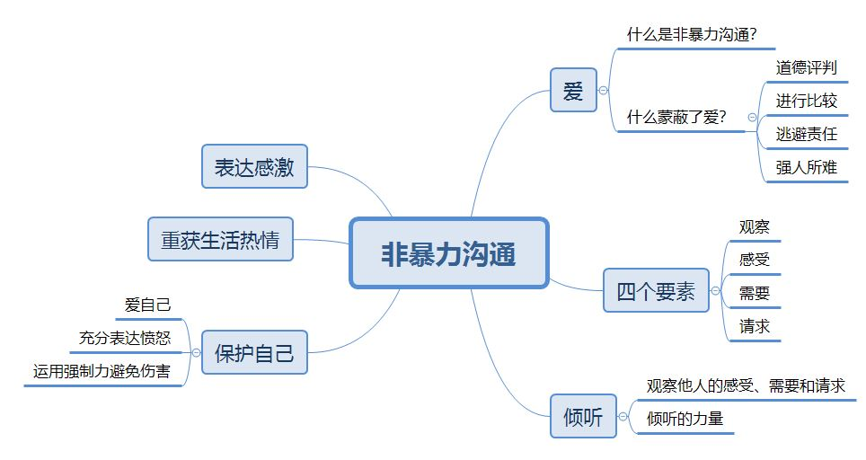

# 非暴力沟通

## 爱

​	非暴力沟通提醒我们专注与彼此的`观察`、`感受`、`需要`和`请求`。它鼓励倾听，培育尊重与爱，使我们情意相通，乐于互助。

### 什么蒙蔽了爱？

-   道德评判：是用道德标准来评判人，如果一个人的行为不符合我们的价值观，那他就被看作是不道德的或者邪恶的。
-   进行比较：比较也是评判的一种。会让自己和他人心情低落。
-   逃避责任：我们对自己的思想、情感和行动负有责任。
-   强人所难：我们对别人的要求往往暗含着威胁，如果不配合，他们就会收到惩罚。

## 观察

>   “不要把他人的行为和自己的感受混为一谈。”
>
>   “我们的语言年代久远，但是先天不足，是一种有缺陷的工具。……静态的语言和动态的世界并不匹配。”
>
>   “不带评论的观察是人类智力的最高形式。”

### 区分观察和评论

| 表达方式                   | 观察和评论混为一谈            | 区别观察和评论                    |
| ---------------------- | -------------------- | -------------------------- |
| 使用的语言没有体现出评论的人对其评论负有责任 | 你太大方了。               | 当我看到你把吃午饭的钱都给了别人，我认为你太大方了。 |
| 把对他人思想、情感或愿望的推测当做唯一的可能 | 她无法完成工作。             | 我不认为她能完成工作。或她说：“我无法完成工作。”  |
| 把预测当做事实                | 如果你饮食不均衡，你的健康就会出现问题。 | 如果你饮食不均衡，我就会担心你的健康会出问题     |
| 缺乏依据                   | 米奇花钱大手大脚。            | 米奇上周买书花了一千元。               |
| 评价他人能力时，把评论当做事实        | 欧文是个差劲的前锋。           | 在过去的5场比赛中，欧文没有进一个球。        |
| 使用形容词和副词时，把评论当做事实      | 索菲长得丑。               | 索菲对我没有什么吸引力。               |
| “经常”                   | 你很少配合我。              | 我最近组织了三次活动，每次你都说你不愿意参加     |
| “很少”                   | 他经常过来。               | 他每周最少来过三次。                 |

## 感受

​	通过建立表达词汇，我们可以更清楚地表达感受，从而使沟通更为顺畅。表达感受时，示弱有助于解决冲突。

### 建立表达感受的词汇表

| 我们的需要得到满足                                | 我们的需要没有得到满足                              |
| ---------------------------------------- | ---------------------------------------- |
| 兴奋、喜悦、欣喜、甜蜜、经历充沛、兴高采烈、感激、感动、乐观、自信、振作、开心、高兴、快乐、愉快、幸福、陶醉、满足、欣慰、心旷神怡、喜出望外、平津、自在、舒适、轻松、踏实、安全、温暖、放心、无忧无虑 | 害怕、担心、焦虑、忧虑、着急、紧张、心神不宁、心烦意乱、忧伤、沮丧、灰心、气馁、泄气、绝望、伤感、凄凉、悲伤、恼怒、愤怒、烦恼、苦恼、生气、厌烦、不满、不快、不耐烦、不高兴、震惊、失望、困惑、茫然、寂寞、孤独、郁闷、难过、悲观、沉重、麻木、精疲力尽、萎靡不振、疲惫不堪、昏昏欲睡、无精打采、尴尬、惭愧、内疚、嫉妒、遗憾、不舒服 |

## 需要

### 需要→想法的根源

听到不中听的话的四种选择：

1.  责备自己
2.  职责他人
3.  体会自己的感受和需要
4.  体会他人的感受和需要

>   “一个人如果无法说出自己的需要，会是多么的痛苦。”

使用以下表达方式的时候，我们可能就已经忽视了感受与自身的关系。

1.  只提及相关的事情
    1.  “公司的海报出现拼写错误使我很生气”
    2.  “这件事令我心神不宁”
2.  只提及他人的行为
    1.  “我生日那天你没打电话，我很伤心”
    2.  “你没有把饭吃完，妈妈很失望”
3.  指责他人
    1.  “我很伤心，因为你说你不爱我”
    2.  “我很生气，因为老板说话不算数”

我们可以通过 **“（对于某件事）……我（感到）…… 因为我……”** 这种方式来认识感受与自身的关系。例如：

1.  “看到公司海报出现拼写错误，我很不高兴。因为重视公司形象。”
2.  “你没把饭吃完，妈妈感到很失望。因为妈妈希望你能健康成长。”
3.  “老板说话不算数，我很生气。因为我想有个长假去看弟弟。”

### 个人成长的三个阶段

对于大多数人来说，个人成长一般会经历三个阶段：

1.  “情感的奴隶”时期——我们认为自己有义务使他人快乐；
2.  “面目可憎”时期——此时，我们拒绝考虑他人的感受和需要；
3.  “生活的主人”时期——我们意识到，虽然我们对自己的意愿、感受和行动负有完全责任，但无法对他人负责。与此同时，我们还认识到，我们无法牺牲他人来满足自己的需要。

## 请求

请求：

1.  提出具体要求
2.  明确谈话目的
3.  请求反馈
4.  了解他们反映
    1.  对方此时此刻的感受
    2.  对方正在想什么
    3.  对方是否接受我们的请求

我们告诉人们，为了改善生活，我们希望他们做什么。我们要避免使用抽象的语言，而借助具体的描述，来提出请求。

在发言时，我们将自己想要的回应讲的越清楚，就越有可能得到理想的回应。由于我们所要表达的意思与别人的理解有可能不一致，有时，我们需要请求他人反馈。特别是在集体讨论中发言时，我们需要清楚地表明自己的期待。否则，讨论可能只是在浪费大家的时间。

一旦人们认为不答应我们就会收到惩罚，他们就会就会把我们的请求看作是命令。如果我们清楚地表达我们无意强人所难，人们一般会相信，我们提出的是请求而非命令。非暴力沟通的目的不是为了改变他人来迎合我们，相反，非暴力沟通重视每个人的需要，它的目的是帮助我们在诚实和倾听的基础上与人联系。